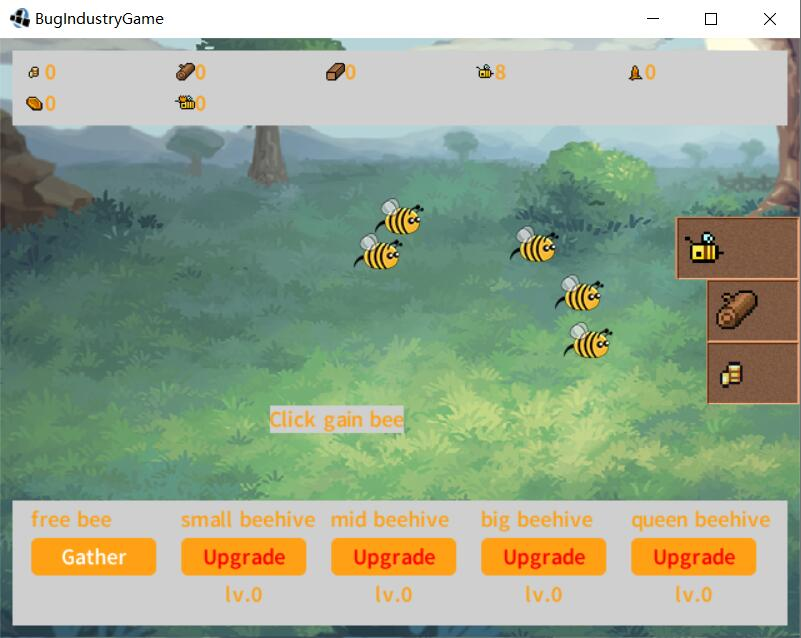
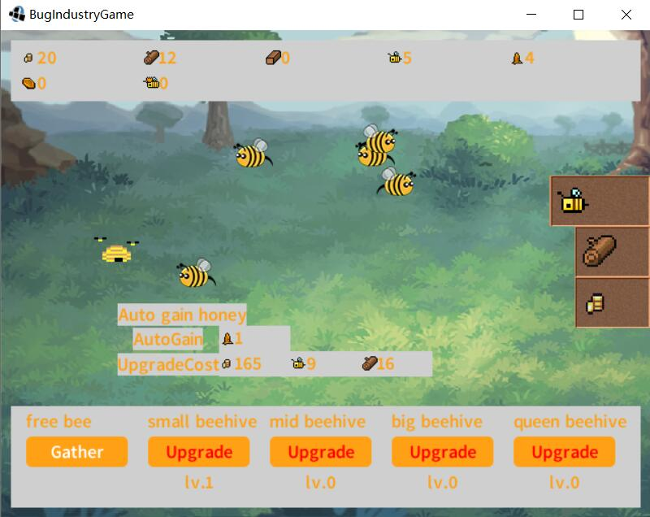

This project created in [Game Off 2021](https://itch.io/jam/game-off-2021/rate/1299345) for the theme `BUG`

## BugIndustry

A clicker game. 

Some bug can become an an industry. 

Now You are a manager of a forest with bees. Gather some wood and wild bee as start. Build beehives which can generate bee, honey and beewax. Sell resources and products for coins. Finally, collect enough queen-bee for win-the-game!

### release

Download the zip. Use the win64 exe file, or the jar file.

### How to play

- Some constuctions are free. Click and gain its output.

- Area-change-button is on the right border. Now we change to forest-area.

- Some constuctions can swtich working-level by "+" / "-" button. Now we enable 1-level wood-selling and gain coins. 

- Upgrade other constuctions if your can afdord its upgrade-cost. And constuction only work if your can afdord its auto-work-cost.

### Assert thanks

Audio:
https://opengameart.org/sites/default/files/Loop-Menu.wav
https://opengameart.org/sites/default/files/forest_0.mp3

image:
https://opengameart.org/content/backgrounds-3
// TODO more

text-generate:
https://cooltext.com/
